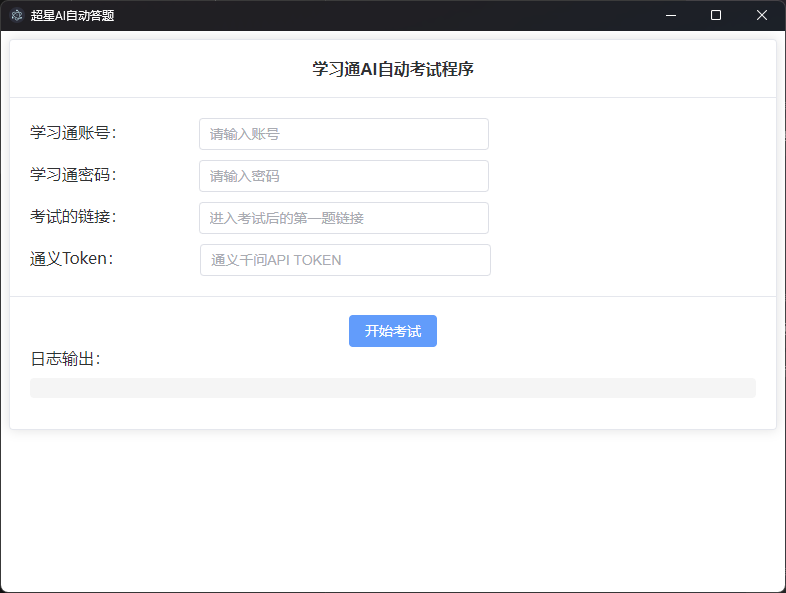

# ChaoxingStudy-Exam - 超星学习通AI自动考试助手 🚀

## 简介 📖

本项目是一个基于AI技术的超星学习通自动考试助手，旨在为用户提供一个便捷的考试辅助工具。通过对接通义千问或Ollama等AI模型，程序能够自动完成考试中的单选题、多选题、填空题和判断题。🤖

## 免责声明 ⚠️

请注意：

- 本项目仅供娱乐和学习交流使用。🎮
- 严禁将本项目用于任何形式的考试舞弊或其他违法违规行为。🚫
- 使用本程序所产生的一切后果由使用者自行承担。💡
- 开发者不对任何因使用本项目而产生的法律责任负责。⚖️

## 快速开始（推荐）🚀

1. 从 Release 页面下载已打包好的程序。📦
2. 运行下载的 exe 文件，程序已支持图形化界面。🖥️

### 程序截图

 

注意：程序默认使用通义千问AI模型，您需要自行申请API密钥。申请地址：[通义千问API](https://bailian.console.aliyun.com/?apiKey=1) 🔑

## 手动运行并调用Ollama 🛠️

如果您希望手动运行程序并使用Ollama作为AI模型，请按照以下步骤操作：

1. 从Git仓库下载源代码。📥

2. 安装所需依赖：

   ```
   pip install dashscope selenium==4.5.0 requests
   ```

3. 配置Chrome浏览器驱动。🌐

4. 在程序中填写您的超星学习通账号和密码。🔐

5. 填写考试链接（登录超星学习通后，点击“开始考试”，复制第一题的链接即可）。📝

6. 选择AI作答来源：Ollama 或 通义千问。

   - 通义千问Token获取：[通义千问API](https://bailian.console.aliyun.com/?apiKey=1) 🔑
   - Ollama对接：请自行修改代码第58至66行。💻

## 注意事项 📌

- 目前本项目仅支持单选题、多选题、填空题和判断题的自动作答。✅ 
- 使用前请确保已正确配置AI模型和相关依赖。🔧

## 版本 1.0.5 - 新增填空题图片识别 🆕

### 更新内容 📅

- **新增填空题图片识别**：对填空题支持图片识别和处理📝

## 版本 1.0.4 - 新增填空题支持 🆕

### 更新内容 📅

- **新增填空题支持**：现在程序已支持自动作答填空题，进一步提升了考试辅助的全面性。📝

## 贡献与反馈 🤝

如果您有任何建议或问题，欢迎提交Issue或Pull Request。感谢您的支持！🙏

声明：本项目仅为技术演示，请勿用于任何违法违规用途。⚖️
